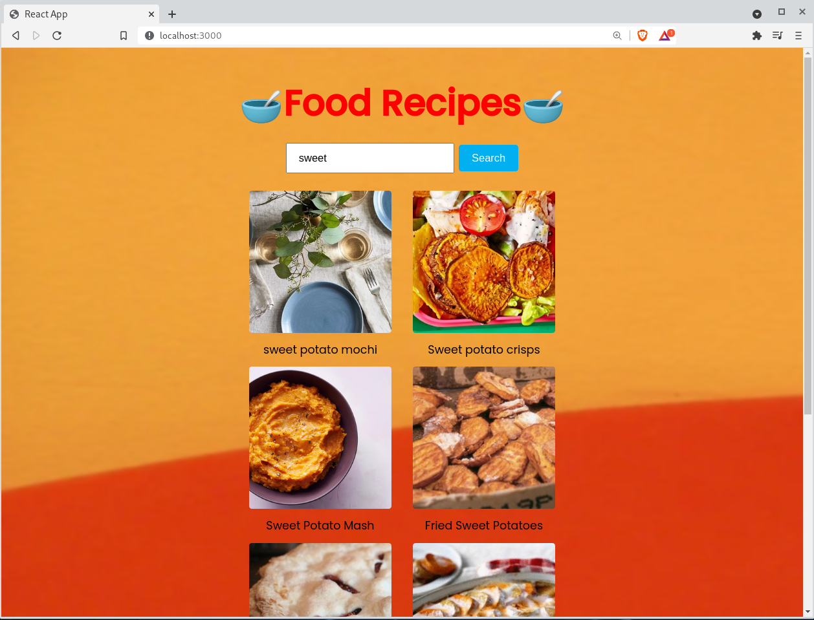

### 🧆🥘 FOOD RECIPE APP🥘🧆 

- Created with React.js, using [Recipe Search APi][1] and Axios

**Preview**

### Installation

-Clone the repository

-To install and run this proyect just type and execute

`npm install`

-Start the proyect with

`npm start`

👩‍💻

[1]: https://developer.edamam.com/edamam-docs-recipe-api "Recipe Search API "